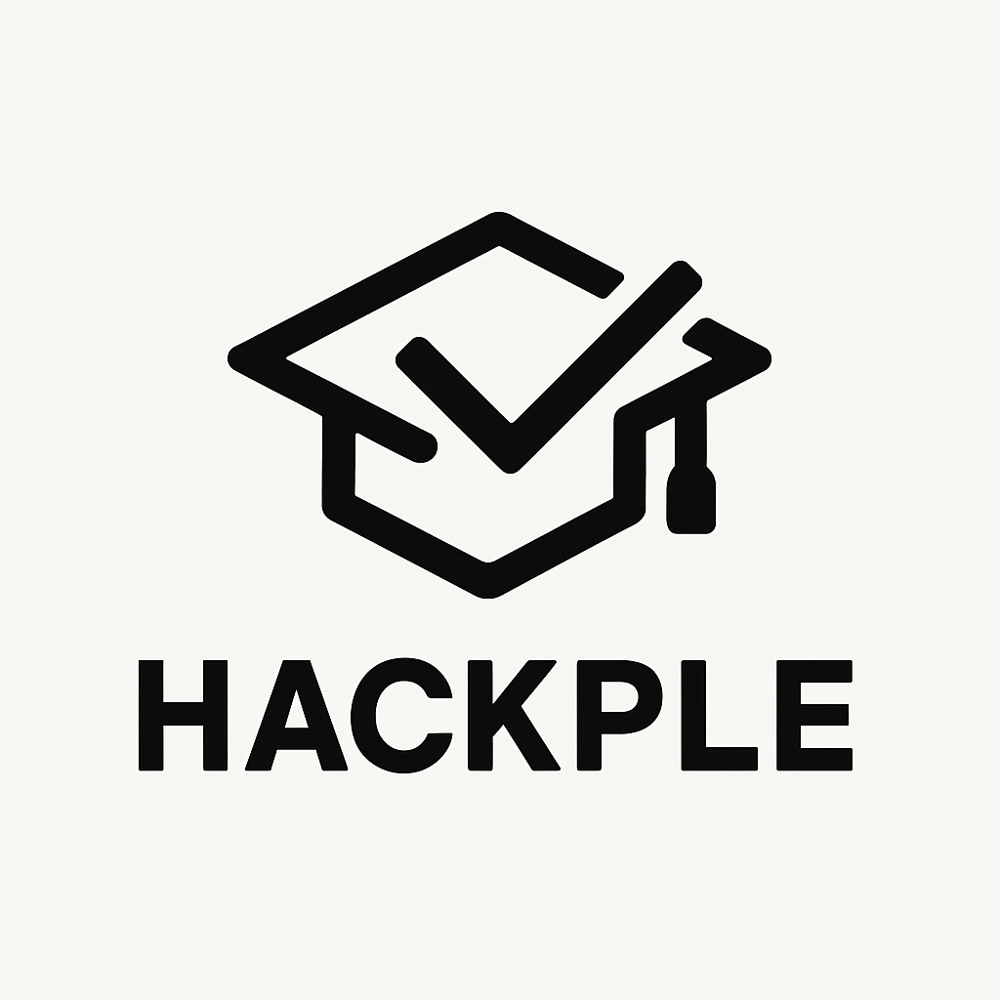

<p align="center">
  
</p>

<h1 align="center">Hakple</h1>

> 학원생을 위한 커뮤니티 플랫폼

**Hakple**는 학원 수강생들이 소통하고, 질문하고, 정보를 공유할 수 있는 커뮤니티 플랫폼입니다.  
주요 기능으로는 회원가입, 게시판(질문/인기), 공지사항 열람, 댓글/좋아요 기능과, 실시간 알림 서비스 등이 있습니다.

## 👥 팀원 소개

<table>
  <tr>
    <td align="center">
      <br/>
      <b>박주호</b><br/>
      팀장/얼굴마담<br/><br/>
      역할:<br/>인증, 인가, 응원
    </td>
    <td align="center">
      <br/>
      <b>김명수</b><br/>
      부팀장<br/><br/>
      역할:<br/>유저 등록
    </td>
    <td align="center">
      <br/>
      <b>고희은</b><br/><br/>
      역할:<br/>사용자 프로필 관리, 배포
    </td>
    <td align="center">
      <br/>
      <b>도상원</b><br/><br/>
      역할:<br/>게시글 기능
    </td>
    <td align="center">
      <br/>
      <b>황지윤</b><br/><br/>
      역할:<br/>댓글 기능, 관리자 기능
    </td>
  </tr>
</table>


## 📸 UI 스크린샷

<details>
  <summary>메인 페이지 화면 보기</summary>

  <p align="center">
    
  </p>

</details>

---

## 🛠️ 주요 기능

- **회원 관리**: 회원가입, 로그인, 프로필 수정
- **게시판**: 질문/답변, 자유게시판 기능
- **공지사항**: 학원 공지사항 등록 및 열람
- **댓글 및 좋아요**: 소통 강화
- **알림 기능**: 새로운 소식 실시간 알림

---

## 🏗️ 기술 스택

| 분야 | 기술 |
|:---|:---|
| Backend | Java 21, Spring Boot |
| Frontend | JavaScript, React, Next.js |
| Database | MySQL, Redis, S3 |
| DevOps | Docker, Terraform, AWS (EC2, RDS) |
| CI/CD | GitHub Actions |

---

## 🚀 Getting Started

### Backend (Spring Boot)
```bash
# 1. 프로젝트 클론
git clone https://github.com/golden-dobakhe/hakple.git
cd hakple/backend

# 2. 환경변수 설정
cp src/main/resources/application.yml.example src/main/resources/application.yml
# (application.yml을 자신의 DB/환경에 맞게 수정하세요)

# 3. 서버 실행
./gradlew bootRun
```
### Frontend (Next.js)
```bash
cd hakple/frontend

# 의존성 설치
npm install

# 개발 서버 실행
npm run dev

```
---

## 🛠️ 주요 기능 상세

- 회원 관리
  - 회원가입 / 로그인 (JWT 인증)
  - 프로필 수정 (후대폰 번호, 프로필 이미지 변경)
- 게시판
  - 자유 게시판 / 인기 게시판 분리
  - 글 작성, 수정, 삭제
- 공지사항
  - 관리자 공지 등록
  - 사용자 공지 열람
- 댓글 / 좋아요
  - 게시글 댓글 작성 및 삭제
  - 게시글 좋아요 기능
- 알림
  - 댓글, 좋아요, 공지사항에 대한 실시간 알림
- 캘린더
  - 사용자 맞춤 캘린더 제공
  - 일정 추가,삭제,수정 기능
  - 일정 알림 기능
- 관리자
  - 학원 관리
  - 관리자 관리
  - 회원 목록 조회 등등
 
---

## :open_file_folder: Project Structure

```markdown
backend
└── src
    └── main
        └── java
            └── com
                └── golden_dobakhe
                    └── HakPle
                        ├── config          # AWS S3 설정 등
                        ├── domain          # 핵심 도메인 로직
                        │   ├── notification # 알림
                        │   ├── post         # 게시글 (board, comment, like, report)
                        │   ├── resource     # 리소스 (image)
                        │   └── user         # 사용자 (admin, exception, myInfo, user)
                        ├── global          # 전역 설정 (entity, exception, Status enum 등)
                        └── security        # Spring Security 관련 (config, controller, dto, exception, jwt, OAuth, service, utils
```

---


 
## 🌐 배포 주소
- [Hakple 웹사이트 링크](https://www.hakple.site)

---

## 🎥 데모 영상


멋쟁이사자처럼 부트캠프 백엔드JAVA 프로젝트입니다
